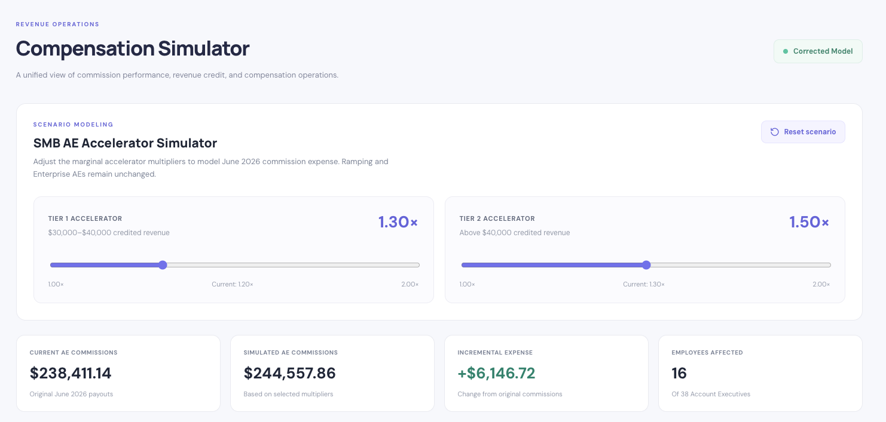

# CommissionOS | Sales Compensation Analytics Dashboard

**Interactive Commission Analytics | React • TypeScript • Vite • Recharts • Synthetic Data**

[**Launch Live Dashboard**](https://pronoeo77.github.io/commission-os/) | [**View Source Code**](https://github.com/pronoeo77/commission-os)

## Dashboard Preview



## Project Overview

CommissionOS is an interactive sales compensation analytics application combining commission reporting, revenue integrity analysis, compensation scenario modeling, and transparent calculation logic in one dashboard.

Built with React, TypeScript, and Vite, the application demonstrates how financial analysis and software development can work together to automate complex compensation calculations and present actionable business insights.

## Dashboard Features

### 1. Executive Overview
- Commission expense KPIs and financial summaries
- Account Executive, Account Manager, and Management commission breakdowns
- Interactive charts and performance metrics

### 2. Commission Explorer
- Individual employee commission reporting
- Revenue credit, attainment, and payout analysis
- Role-based comparisons and filtering

### 3. Revenue Integrity
- Revenue attribution and data-quality exception analysis
- Financial exposure and exception severity
- Recommended reconciliation treatments

### 4. Compensation Simulator
- Interactive SMB Account Executive accelerator modeling
- Adjustable Tier 1 and Tier 2 commission multipliers
- Real-time commission expense calculations
- Employee-level impact analysis

### 5. Commission Logic
- Transparent commission calculation methodology
- Accelerator thresholds and marginal commission rates
- Ramp guarantees, retention incentives, and management rollups

## Technology Stack

| Technology | Application |
|---|---|
| React | Interactive dashboard components |
| TypeScript | Typed application logic |
| Vite | Development and production builds |
| Recharts | Financial data visualization |
| JavaScript | Synthetic data generation |
| GitHub Actions | Automated deployment |
| GitHub Pages | Live application hosting |

## Analytical Methodology

CommissionOS models compensation for 80 fictional employees across Account Executive, Account Manager, and Management roles.

The application demonstrates:

- Tiered and marginal commission calculations
- Ramp guarantees and quota attainment
- Account Manager retention incentives
- Hierarchical management revenue rollups
- Compensation scenario analysis
- Commission reconciliation and validation

## Synthetic Data and Privacy

All published financial figures and employee identifiers are synthetic. Employee names are fictional characters.

The project uses a deterministic synthetic-data generator to demonstrate compensation analytics without publishing original assessment workbooks or source records.

The compensation calculations are presented for educational and portfolio demonstration purposes, not production payroll processing.

## Run Locally

```bash
npm install
npm run dev
```

To build the application:

```bash
npm run build
```

## Live Application

**[Open CommissionOS Interactive Dashboard](https://pronoeo77.github.io/commission-os/)**

## Author

**Nicolas Cuervo**

Financial Analytics | Python Automation | React | TypeScript | Business Intelligence

[GitHub Profile](https://github.com/pronoeo77)
